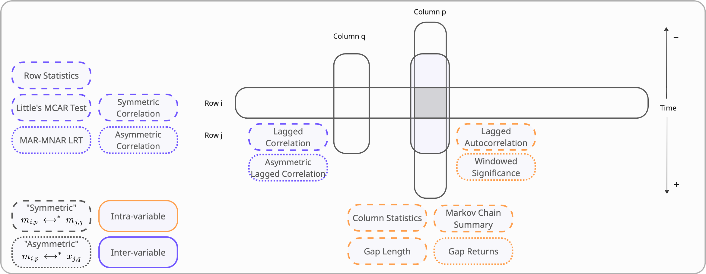

# Analysis Module

This module provides statistical analysis tools for characterizing imperfection (missingness and noise) in time-series data.

## Structure

| Submodule | Purpose |
|-----------|---------|
| `preliminary/` | Descriptive statistics, normality tests, correlation, and autocorrelation |
| `intravariable/` | Within-column analysis: gap patterns, Markov chains, windowed significance |
| `intervariable/` | Between-column analysis: MCAR tests, MAR/MNAR detection, symmetric/asymmetric correlation |
| `irregularity/` | Time-grid irregularity: interval statistics, dominant frequency, burstiness, interval autocorrelation |
| `utils/` | Shared utilities: statistics, group comparison, stratification, visualization, HTML reporting |

## Usage

```python
from imperfekt.analysis import Imperfekt

df = pl.DataFrame(
    {
        "patient": ["a", "a", "a", "a", "b", "b", "b"],
        "time": [
            "2023-01-01 08:00",
            "2023-01-01 08:05",
            "2023-01-01 08:10",
            "2023-01-01 08:15",
            "2023-01-02 12:00",
            "2023-01-02 12:05",
            "2023-01-02 12:10",
        ],
        "heartrate": [60, None, 70, None, 80, 85, None],
        "blood_pressure": [120, 125, None, None, 130, None, 140],
        "resprate": [12, 14, None, 16, 18, None, 20],
    }
).with_columns(pl.col("time").str.strptime(pl.Datetime, format="%Y-%m-%d %H:%M"))

analyzer = Imperfekt(
    df=df,
    id_col="patient",
    clock_col="time",
    clock_no_col="time_no",
    save_path="/path",
    plot_library="matplotlib",
    renderer="notebook_connected",
)
# Run all analyses
analyzer.run()

# Run preliminary analysis only
analyzer.preliminary.run()
```

## Case-Level Metrics

Each aspect exposes a `case_metrics()` method producing one row per case (per case × variable
where the aspect is per-variable). These are the comparable unit of analysis: 19 columns in
total, split into two kinds.

**Imperfection metrics** — 13 constructed indices describing the *shape of the imperfection*,
all bounded except `interval_cv`:

| Aspect | Shape | Metrics |
|--------|-------|---------|
| [Intravariable](intravariable/README.md#7-case-level-metrics-case_metrics) | per case × variable | `indicated_pct`, `indicated_centroid`, `gap_adh_rate`, `gap_entropy` |
| [Intervariable](intervariable/README.md#7-case-level-metrics-case_metrics) | per case | `avg_indicated_pct`, `co_concentration`, `breadth`, `max_pair_overlap`, `pattern_entropy` |
| [Irregularity](irregularity/README.md#6-case-level-irregularity-metrics-case_metrics) | per case | `interval_cv`, `interval_qcod`, `interval_adh_rate`, `interval_entropy` |

**Observed-value summary measures** — 6 plain descriptive statistics of *the data itself*, in
each variable's own units (`value_slope` in units per hour). 

| Aspect | Shape | Metrics |
|--------|-------|---------|
| [Preliminary](preliminary/README.md#6-case-level-observed-value-metrics-case_metrics) | per case × variable | `value_mean`, `value_min`, `value_max`, `value_iqr`, `value_slope`, `value_first` |

Passing `stratify=True` additionally assigns each row to an imperfection quadrant
($Q_{\alpha}$–$Q_{\delta}$) by median-bisecting the least-correlated pair of metrics. This is
**off by default**: the thresholds are fitted to whichever cohort is passed in, so quadrant labels
from separately-fitted cohorts are not comparable.

The quadrant assignment itself lives in [`utils/stratification.py`](utils/stratification.py) as a
generic `assign_strata(df, axis_x, axis_y, x_median, y_median, ...)`. The three modules differ only
in which axes are inverted, what the stratum column is called, and whether a "no imperfection at
all" state exists — all parameters — so each class keeps a thin `assign_strata` staticmethod
supplying its own values. Thresholds are always passed in rather than computed, which is what makes
the function safe for leakage-free cross-validation and for fitting once on a pooled cohort and
applying to each subgroup so labels stay comparable. Call the generic function directly to
median-bisect any pair of columns with your own labels.

## Group Comparison

`run_grouped_analysis(annotation_col=..., analysis_mode="metrics")` computes the case-level metrics
separately per group and then tests whether they differ between groups.

It answers **two** questions, kept deliberately distinct:

| Family | Aspects | Question |
|--------|---------|----------|
| `imperfection` | intravariable, intervariable, irregularity | Does the *data quality* differ between groups? |
| `observed_values` | preliminary | Does the *data itself* — the case-mix — differ between groups? |

The second is what makes the first interpretable. If a group has both more missingness *and*
higher heart rates, the imperfection finding may reflect case-mix rather than the data-generating
process; reading the two tables side by side is what separates them. 

```python
analyzer.run_grouped_analysis(annotation_col="outcome", analysis_mode="metrics")

analyzer.group_comparison_results  # effect size + CI + q per metric, with a `family` column
analyzer.group_comparison_descriptives  # median [IQR], mean (SD), n per group
analyzer.group_comparison_posthoc  # pairwise comparisons (k > 2 groups only)
analyzer.group_comparison_plots  # forest plot per aspect

# The Table 1 view: observed values per group, in the variables' own units
analyzer.group_comparison_descriptives.filter(pl.col("aspect") == "preliminary")
```

### Method

The metrics are bounded and skewed, and `interval_cv` is unbounded and heavy-tailed, so every test
is rank-based:

| Groups | Omnibus test | Effect size | Direction |
|--------|--------------|-------------|-----------|
| 2 | Mann–Whitney U | Cliff's $\delta$ + bootstrap CI | Hodges–Lehmann median difference + distribution-free CI |
| > 2 | Kruskal–Wallis | $\eta^2_H$ + bootstrap CI | group with the highest median, then DSCF pairwise post-hoc |

Three deliberate choices:

- **The effect size is the primary readout, not the p-value.** At cohort sizes typical for this
  library essentially every metric reaches significance, so the q-value gates a finding while the
  effect size ranks it. Cliff's $\delta$ is unit-free, which is what makes metrics on different
  scales comparable on one forest plot.
- **Benjamini–Hochberg FDR is applied once per family** — across all aspects, variables and
  metrics *within* a family, but never across the two. Bonferroni controls the wrong error rate
  for many correlated metrics, and correcting per aspect would under-correct; but correcting the
  two families together would mean that describing the cohort more thoroughly raises the
  q-values of the imperfection findings, which is not a real loss of evidence. A multiplicity
  correction controls the error rate over the hypotheses answering *one* question, and these are
  two. Both `q_value` and `definedness_q_value` are corrected this way.
- **Definedness is tested too.** `gap_adh_rate` is `null` for a case with no gaps, `interval_*` for
  a case with fewer than two intervals, `value_*` for a case in which the variable was never
  recorded. If a metric is computable more often in one group than another, any effect size is
  computed on a self-selected subsample. `pct_defined` appears in the descriptives and
  `definedness_q_value` in the results. For the observed-value metrics `pct_defined` reads
  directly as "% of cases in which this variable was ever recorded", so differential availability
  is itself a reportable finding.

Metrics that cannot be tested — fewer than three defined values in a group, or no pooled variance —
are reported with a `skipped_reason` rather than dropped, so an absent row never reads as a null
result.

Two notes specific to the observed-value family. Its metrics are computed on observed values only,
so under MNAR a case's mean is a biased estimate of its true mean and the bias may differ by group.
And because those metrics are in the variables' own clinical units rather than bounded, that aspect
gets **one box plot per variable** (`preliminary_descriptives_box_{variable}.png`) instead of one
shared figure — a panel holding SpO₂ next to lactate would flatten the smaller of the two.

## Detailed Documentation

Each submodule contains its own README with further details:

- [Preliminary Analysis](preliminary/README.md)
- [Intravariable Analysis](intravariable/README.md)
- [Intervariable Analysis](intervariable/README.md)
- [Irregularity Analysis](irregularity/README.md)

### Overview Figure



